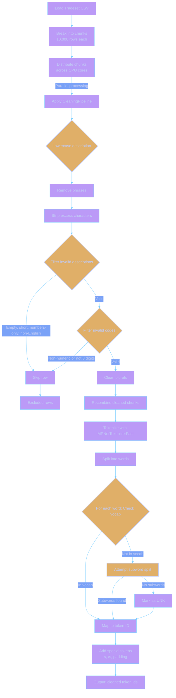

# Understanding Data Cleaning

## What is cleaning?

We have multiple sources of data used to train the FPO model and inform bulk classification of input descriptions.

You can think of the data sources as being of three kinds:

- Produced by humans without much thought or oversight just to tick a box
- Produced by humans with some thought and oversight required by government staff
- Produced by humans with significant thought and oversight required for classification

Cleaning targets the first and second kinds of source data mostly which includes all manner of meaningless content, unrecognised model numbers, irrelevant filler, etc.

Most of the cleaning happens using a tokeniser in our sentence transformer pipeline but we also clean using custom cleaners based on specific patterns we've found.

Most of the cleaning targets descriptions of commodities but we also clean the corresponding goods nomenclature codes based on our requirements that they must be at least 8 digits long and numeric.

Cleaning takes two forms:

1. Cleaning (e.g. changing the data into a better form)
2. Filtering (e.g. removing the data entirely when its not fit for purpose)

We typically process millions of descriptions and codes from different sources in every training run so most of our focus will be on cleaning during this stage of the FPO tool's lifecycle.

## Custom cleaners

| Cleaner Name | Description | Used in Training | Used in Inference |
|--------------|-------------|------------------|-------------------|
| **StripExcessCharacters** | Strips leading/trailing whitespace, newlines, tabs, carriage returns, periods, and commas from subheadings and descriptions. Normalizes multiple spaces in descriptions to single spaces. | Yes | Yes |
| **PluralCleaning** | Converts odd plural forms in descriptions (e.g., "women s" to "womens") while preserving specific forms like "size s". | Yes | No |
| **IncorrectPairsRemover** | Removes incorrect subheading-description pairs based on a CSV file specifying descriptions, correct chapters, and codes to skip. | Yes | No |
| **RemoveEmptyDescription** | Skips pairs where the description is empty or contains only whitespace after stripping. | Yes | Yes |
| **RemoveShortDescription** | Skips pairs where the description length is less than or equal to a specified minimum (default 4, set to 1 in pipelines). | Yes | Yes |
| **RemoveSubheadingsNotMatchingRegexes** | Skips pairs where the subheading doesn’t match provided regexes (e.g., all digits and must be 8 of them). Ensures valid commodity codes. | Yes | No |
| **RemoveDescriptionsMatchingRegexes** | Skips pairs where the description matches regexes for invalid patterns (e.g., only numbers, numbers with dashes, decimals, or punctuation). | Yes | Yes |
| **LanguageCleaning** | Filters non-English descriptions using the `lingua` library. Keeps descriptions in preferred languages (e.g., English), exact matches, or partial matches for specified terms. | Yes | Yes |
| **NegationCleaning** | Removes negations from descriptions (e.g., "tomatoes, other than monster beef tomatoes" → "tomatoes") using regexes for terms like "not", "except". | Yes | No |
| **DescriptionLower** | Converts descriptions to lowercase to standardize case for consistent processing. | Yes | Yes |
| **PhraseRemover** | Removes specified phrases (loaded from a file) from descriptions. Skips pairs if the description becomes empty after removal. | Yes | No |
| **PadCodes** | Pads 6-digit subheading codes to 8 digits by appending zeros (e.g., "123456" → "12345600"). | Yes | No |
| **Map2024CodesTo2025Codes** | Maps 2024 commodity codes to 2025 codes. | Yes | No |

## Data sources

Each data source can have the following attributes:

- *Authoritative* - This defines whether code answers in this data source override other data sources that precede it. This concept assumes 1 code for 1 description and subsequent matching descriptions will be ignored/skipped over if they have a different code.
- *Creates Codes* - Our initial list of possible codes come from the data source that has this flag set to true. Our codes originate from the CN data source but can be augmented by other data sources that have this flag set to true.
- *Cleaning pipeline* - Each data source can have a custom cleaning pipeline applied to it. This is a series of cleaners and filters that are applied in sequence to the data source to clean it up before it is used for training or inference.
- *Reinforcement multiplier* - This defines how many times we repeat this data source during training to reinforce its importance/boost output scores for the result. For example, if a data source has a reinforcement multiplier of 5, it will be repeated 5 times during training.

The following outlines the various data sources we clean with a summary of the cleaning applied to each.

- Data Source - The name of the data source being cleaned.
- Cleaners Used - The specific cleaners and filters applied to the data source using a custom cleaning pipeline.
- Description - A brief description of the data source and its purpose.
- Reinforcement Muliplier - How many times we repeat this data source during training to reinforce its importance/boost output scores for the result

| Data Source | Cleaners Used | Description | Reinforcement Multiplier |
|-------------|-----------------------|-------------|-------------------------|
| Tradesets CSV | DescriptionLower, PhraseRemover, StripExcessCharacters, RemoveEmptyDescription, RemoveShortDescription, RemoveSubheadingsNotMatchingRegexes, RemoveDescriptionsMatchingRegexes, LanguageCleaning, IncorrectPairsRemover, PluralCleaning | Very large CSV file containing trade transaction data requiring comprehensive cleaning to handle noisy, real-world data. | 1 |
| Search References | DescriptionLower, StripExcessCharacters, RemoveEmptyDescription, RemoveShortDescription, RemoveSubheadingsNotMatchingRegexes, Map2024CodesTo2025Codes | API data source authored via the admin app with search-related reference mappings for commodity codes, weighted heavily to improve search-based classification accuracy. | 10 |
| Brands CSV | PadCodes, DescriptionLower, StripExcessCharacters, RemoveEmptyDescription, RemoveShortDescription, RemoveSubheadingsNotMatchingRegexes, Map2024CodesTo2025Codes | CSV file with brand-specific commodity descriptions and codes  | 5 |
| Extra References CSV | DescriptionLower, StripExcessCharacters, RemoveEmptyDescription, RemoveShortDescription, RemoveSubheadingsNotMatchingRegexes, Map2024CodesTo2025Codes | CSV file with additional reference data for commodity codes, providing authoritative mappings. Duplicates search references concept with less reinforcement. | 5 |
| CN Data CSV | DescriptionLower, StripExcessCharacters, RemoveEmptyDescription, RemoveShortDescription, RemoveSubheadingsNotMatchingRegexes, Map2024CodesTo2025Codes, NegationCleaning | CSV file containing Combined Nomenclature (CN) data, a standard EU tariff classification system for training authoritative classifications. | 3 |
| Vague Terms CSV | DescriptionLower, StripExcessCharacters, RemoveEmptyDescription, RemoveShortDescription, RemoveSubheadingsNotMatchingRegexes, Map2024CodesTo2025Codes | CSV file containing vague or ambiguous commodity descriptions, likely with regex patterns to identify them, used to train the model to handle non-specific terms. | 1 |
| Commodities | DescriptionLower, StripExcessCharacters, RemoveEmptyDescription, RemoveShortDescription, RemoveSubheadingsNotMatchingRegexes, Map2024CodesTo2025Codes, NegationCleaning | Descriptions pulled from the OTT database. | 1 |

## Cleaning process (trade sets example)

By way of example, our largest cleaning step is to remove junk out of the descriptions in the tradeset data. These are essentially csv files with millions of rows of data. The cleaning process is as follows:

- Load the data from the csv file
- Break it into chunks (of say 10,000 rows)
- Divide each chunk across multiple CPU cores
- Execute a cleaning function on each of the millions of rows of the CSV file
- The cleaning function walks through a series of cleaners and filters which include:
  - Lowercasing the description
  - Removing specific phrases (e.g. "value for customs purpose only", etc.)
  - Stripping excess characters (e.g. leading/trailing whitespace, newlines, etc.)
  - Filtering out rows with empty descriptions
  - Filtering out rows with descriptions that are too short (e.g. less than 3 characters)
  - Filtering out rows with codes that are not numeric and 8 digits long
  - Filtering out rows with descriptions that are only numbers or special characters
  - Filtering out rows with descriptions that are recognised as being in a non-preferred language (e.g. not English)
  - Filtering out rows with codes and descriptions that are known to be incorrect pairs (e.g. from a curated list)
  - Custom cleaning of plural forms (e.g. occasionally "womens" is presented as "women s")
- Recombine the custom cleaned chunks into a single list
- Run the descriptions through a sentence transformer tokenizer which:
  - Splits descriptions into words
  - Checks to see if each word is in the model's [vocabulary file][vocab-file] of recognised words
  - Splits unrecognised words into subwords if possible using a greedy longest-match-first algorithm
  - Marks unrecognised words as [UNK] which become interesting purely for their position in the overall description but unmeaningful in themselves

This can all be visualised as follows:

[vocab-file]: https://huggingface.co/sentence-transformers/all-mpnet-base-v2/raw/main/vocab.txt
