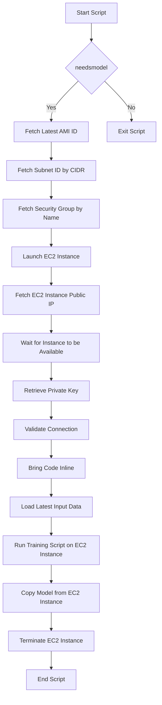
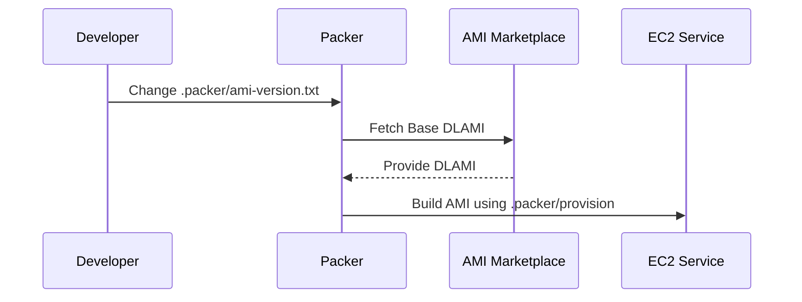

# Understanding model generation

In our pipeline, we generate machine learning models designed to classify input descriptions into specific goods nomenclature codes, either 6 or 8 digits long. This document outlines the key components and steps involved in this process, ensuring transparency and reproducibility.

## Design Objectives for Model Generation

To ensure that our model generation pipeline is efficient, reliable, and sustainable, we've established several key objectives:

- **Separation from the Code**: It is vital that our codebase remains deployable independently of any specific model version. This separation ensures that updates to the application logic can occur without mandatory synchronizations with model updates, thus enhancing agility and reducing deployment complexities.
- **Reproducibility**: Every aspect of model training, from data input to final model parameters, must be traceable and reproducible. This ensures that any previously developed model can be recreated exactly, providing essential support for debugging, auditing, and enhancing model transparency.
- **Collision Protection**: Our infrastructure must support the concurrent generation of models. This allows for continuous integration and testing across multiple feature branches without risk of interference, thereby streamlining development workflows and reducing bottlenecks.
- **Easy Garbage Collection**: The system should facilitate the straightforward management and deletion of outdated models. By automating the tracking and removal of models no longer in production use, we can optimize resource usage and maintain a clean operational environment.

## Key Components

- **DLAMI (Deep Learning AMI)**: Amazon Machine Images specially configured for deep learning tasks. [Learn more about DLAMI](https://docs.aws.amazon.com/dlami/latest/devguide/gs.html).
- **Packer**: Used to create machine images from a single source configuration. [Learn more about Packer](https://www.packer.io/).
- **EC2**: Amazon Elastic Compute Cloud where the models are trained and deployed.
- **GithubActions**: Our continuous integration service that orchestrates the build and deployment processes.
- **Raw Data Sources**: Essential inputs needed for generating embeddings and training the models.
- **Additional Data Sources**: Supplementary data that may change over time and influence model training.

A model is generated when changes are made to the search-config.toml file
and a feature branch is opened.

## Model prefixes

A model prefix is made up of several files and has a prefix label which includes
the version of the model in the search-config.toml file and the sha that was used
to generate the model.

The following is an example built and fully deployed (deployed as far as production)
model. Models without an existing feature branch that have only deployed to development
will get rotated.

A fully deployed model is comprised of several files

```sh
aws s3 ls --human-readable --recursive s3://trade-tariff-models-382373577178/

2024-05-16 21:30:46    0 Bytes  0.0.2-aff1242/development # indicates we've deployed this model to development
2024-05-16 21:30:46    0 Bytes  0.0.2-aff1242/staging # indicates we've deployed this model to staging
2024-05-16 21:30:46    0 Bytes  0.0.2-aff1242/production # indicates we've deployed this model to production
2024-05-16 21:29:52  181.5 MiB  0.0.2-aff1242/model.zip # contains the model and suhbeadings file (needed for inference)
2024-05-16 21:30:24  569 Bytes  0.0.2-aff1242/search-config.toml # includes the model inputs for instantiation of this model
2024-05-16 21:30:24  1.5 KB     0.0.2-aff1242/benchmark_results.xml # a junit formatted results file including the accuracy results for this model
```

## Building a new model prefix

We build a new model when the `search-config.toml` file changes

This step depends on a provisioned [DLAMI][] configured with [packer][]

The overall flow of building a new model looks like this:

> The training script coordinates the loading of the datasources the generation
> of the embeddings and the model creation. It also depends on the model
> bucket having raw_data_sources.zip in its root path.



Once this model is built it will then be fetched by our deployment process
and loaded into a Docker container which is subsequently built and deployed
to our API gateway in development, staging and production.

## Building a new ami

Occasionally a developer/datascientist will need to include new tooling
or dependencies in the base image we generate for producing these models.

This can be done by updateing the .packer/provision script and by bumping
the .packer/ami-version.txt file.



[DLAMI]: https://docs.aws.amazon.com/dlami/latest/devguide/gs.html
[packer]: https://www.packer.io/
